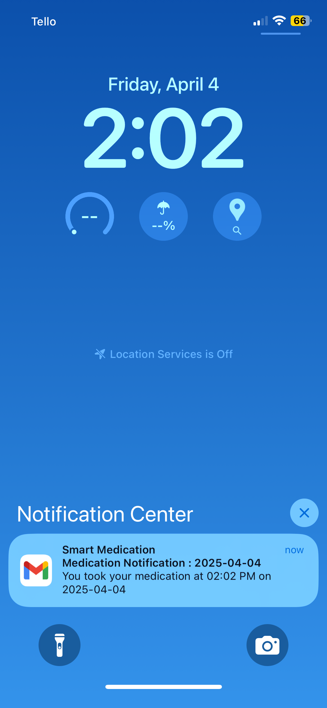

# Smart Medication Bottle 💊

**Technologies Used:** ESP8266 · C++ · AWS Lambda · DynamoDB · Alexa Skills · IoT

## Overview
This project helps users maintain their medication schedule by detecting when the bottle is opened and sending alerts. It also integrates with Alexa to allow users to ask if they've taken their medication.

## Introduction
Does anyone else struggle with remembering to take their pill every day? My biggest challenge isn’t just forgetting—it’s not knowing whether I’ve already taken it, which can lead to double dosing or missing a dose entirely. Not ideal!

To solve this, I decided to combine my software development skills with new hardware skills like soldering, circuit design, and IoT to build a smart notification system that ensures I never forget my medication. Since I also love using Alexa in my daily life, I saw this as a great opportunity to refresh my AWS skills as well!

## Initial Design
- **Microcontroller:** ESP12F (NodeMCU D1 Mini)
  - Compact size ideal for attaching to a bottle
  - Built-in Wi-Fi and Bluetooth for connectivity
- **Normally Open (N.O) Reed Switch:**
  - Normally Open (N.O) reed switch triggers reset when the bottle is opened
  - The magnet is place on a cap of the bottle and the reed switch is placed on the body. 
- **Power Efficiency:**
  - Board stays in deep sleep mode when not in use
  - RST and GPIO16 (D0) are connected for automatic reset
  - Normally Open (N.O) reed switch triggers reset when the bottle is opened
- **Wake-Up Behavior:**
  - On opening the bottle, magnet moves from reed switch, triggering reset
  - `setup()` function sends notification and enters deep sleep immediately
  - Designed to run only 1–2 times per day for maximum battery life

## Initial Circuit Design
- Reed switch near the bottle cap acts as the main trigger
- RST pin goes LOW when bottle is opened
- Deep sleep re-enabled after execution
- Emphasis on simplicity and low power draw

  
  
<em>Initial Circuit Diagram</em>

## First Prototype - One ESP8266
- **Setup:**
  - One ESP8266 detects reed switch state
  - Connects to Wi-Fi and sends notification (email or text)
- **Issues Encountered:**
  - Detection to notification took 10–20 seconds
  - User could finish before message was sent
  - High power consumption from continuous Wi-Fi use

  

    
    
<em>First Prototype</em>

  

  
  

    
    
<em>Email Notification</em>

  

## Second Prototype - Two ESP8266s
- **Setup:**
  - One ESP8266 (client) detects bottle open
  - Sends message via ESP-NOW to another ESP8266 (server)
  - Server is powered via USB, handles Wi-Fi and notification
- **Benefits:**
  - Greatly reduces power use for the client device
  - Faster and more responsive overall
- **Limitation:**
  - ESP-NOW and Wi-Fi both use 2.4 GHz and cannot run concurrently
  - Server must disable ESP-NOW to send data, potentially missing client messages

  
  
<em>Second Prototype with two ESP8266</em>

## Alexa Integration
- **Why Alexa?**
  - Easy, distraction-free access to information
  - Avoids pulling out phone and getting sidetracked
- **Integration Flow:**
  - ESP8266 server sends POST request to AWS API Gateway
  - API Gateway triggers AWS Lambda
  - Lambda writes timestamp to DynamoDB
- **Custom Alexa Skill:**
  - Allows users to ask, "Have I taken my medication today?"
  - Alexa queries DynamoDB through another Lambda function
  - Lambda returns result based on current date comparison
- **Benefits:**
  - Secure, serverless backend
  - Natural voice interaction replaces noisy notifications

  
  
<em>AWS Diagram</em>

  
  
<em>Alexa Demo</em>

## Third Prototype - Perfboard with CR123A
- **Build:**
  - Moved components to perfboard
  - Powered by a CR123A battery
- **Challenge:**
  - Soldering was tricky at first
- **Issue Discovered:**
  - Battery drained within 24 hours
  - Possible causes:
    - Deep sleep not executing properly
    - Reset sequence may cause a current surge, contributing to faster battery depletion
    - Poor circuit design drawing constant power
    - Partial reset may keep board awake
- **Technical Detail:**
  - NodeMCU D1 Mini may require *two* resets to fully reboot
  - Single reset may only wake the board, skipping `setup()`
  - Incomplete reset may leave board active, draining battery

  

    
    
<em>Perfboard Front</em>

  

  
  

    
    
<em>Perfboard Back</em>

  

## Next Step
- **New Plan:**
  - Test a **normally closed reed switch with capacitor** design
- **Design Features:**
  - Switch placed between battery and 3.3V pin
  - Magnet **opens** the switch (no power draw)
  - Removing magnet **closes** the switch (power flows)
  - Capacitor allows more smooth current flow
- **Expected Result:**
  - Board is completely off while bottle is closed
  - Extends battery life beyond what deep sleep allows

## License  
Licensed under the Apache License, Version 2.0 (the "License");  
you may not use this file except in compliance with the License.  
You may obtain a copy of the License at  
[http://www.apache.org/licenses/LICENSE-2.0](http://www.apache.org/licenses/LICENSE-2.0)

Unless required by applicable law or agreed to in writing, software  
distributed under the License is distributed on an "AS IS" BASIS,  
WITHOUT WARRANTIES OR CONDITIONS OF ANY KIND, either express or implied.  
See the License for the specific language governing permissions and  
limitations under the License.

## Authors
- Masakazu Yasumoto

## Acknowledgments
- [Random Nerd Tutorials](https://randomnerdtutorials.com/)
- ESP8266 Community
- Open-source libraries used

